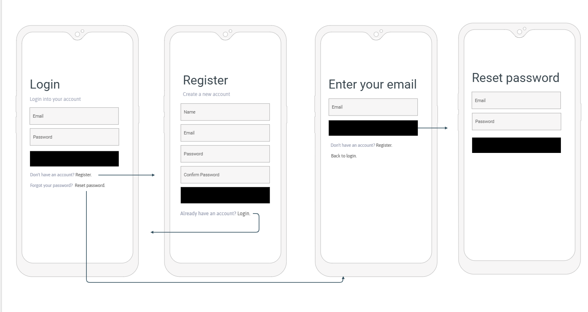
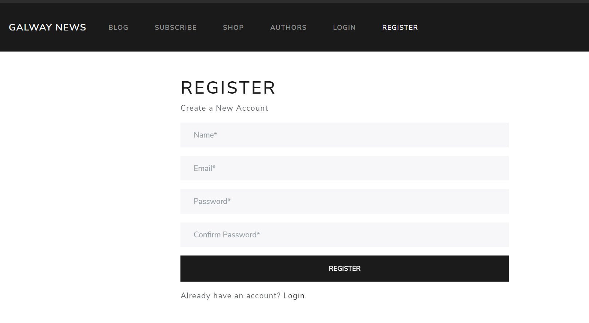
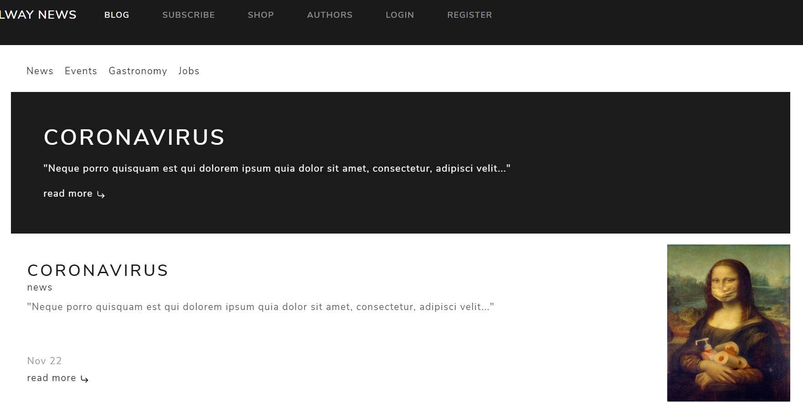
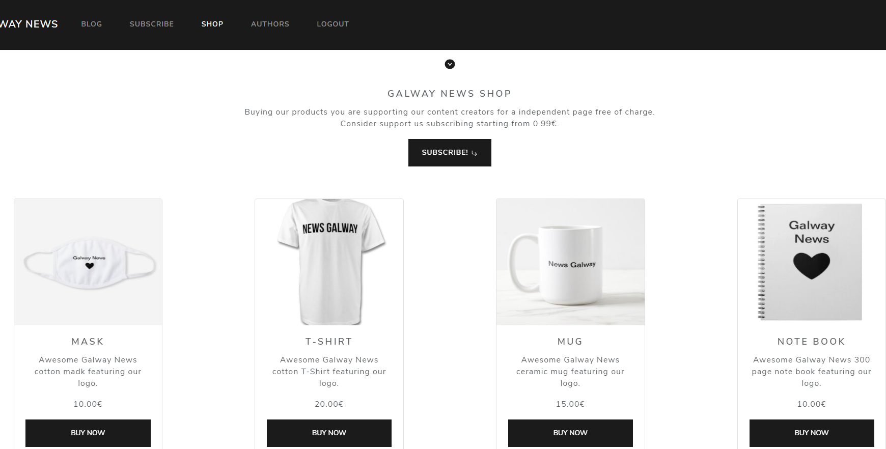
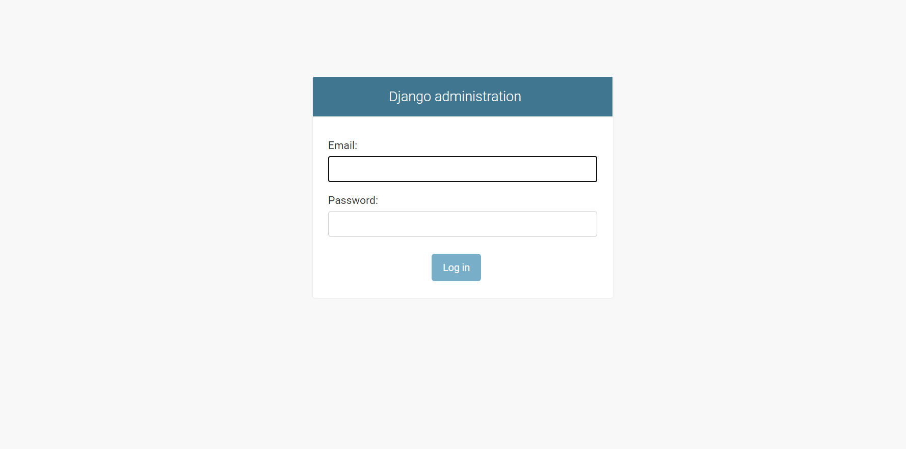
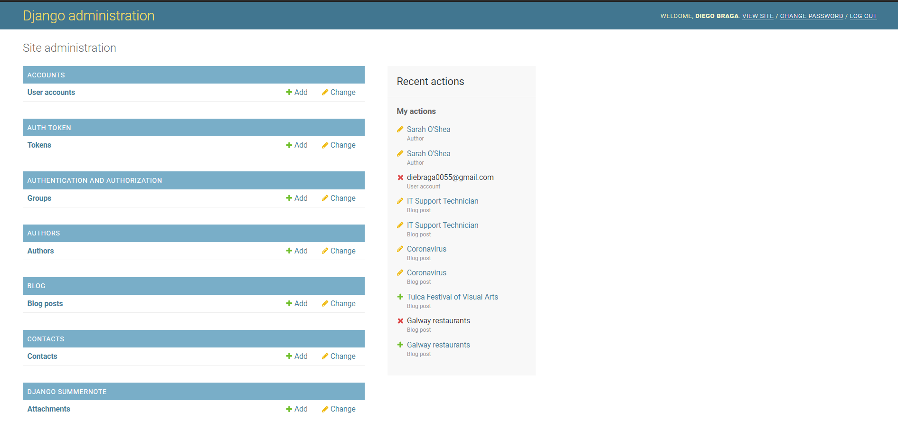

Galway News is a full stack blog app that counts with ecommerce funcionalities integration 'payment and subscription' using Stripe and django admnin panel for content managemment. The app uses JWT authentication, Email handler and Bootstrap for the UI, to get access to the shop and subscrption funcionalities I will need to create an account and Authenticate Use 4242424242424242 to test Succeeds and immediately processes the payment..

Demo: 

https://galway-news.herokuapp.com/

Repository:

https://github.com/diebraga/news_galway

<Row>
<Col>

UI Authentication mockups.

</Col>
<Col>

After register you will need to verify the account in your Email in order to authenticate. 

</Col>
</Row>

<Row>
<Col>

Blog and Blog view mockups.

</Col>
<Col>

Blog section to read more and access blog view section you will need to be authenticated.

</Col>
</Row>

<Row>
<Col>

Shop page integrated to stripe payments, to get access to it you will need to be authenticated.

</Col>
</Row>

<Row>
<Col>

Shop section mockups.

Authors and profile section + get in touch. To access profile you will need to be authenticated. 

in "/admin/" Django admin panel to manage authors/ posts and accounts.

</Col>

<Col>

Success payment demo.

</Col>
</Row>
