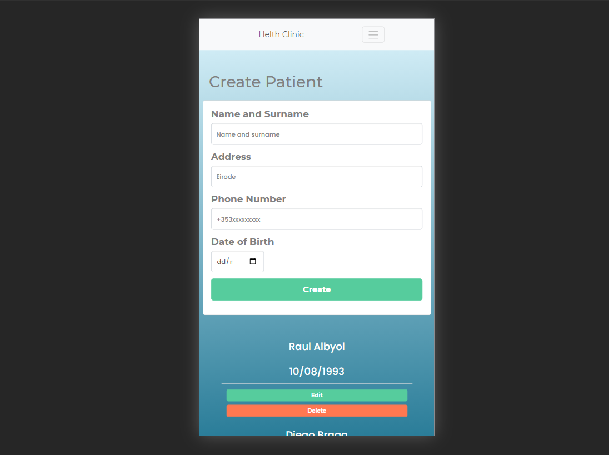

Clinic Health is a full stack crud app that simulates a clinic management patients database in a sigle page where you can create delete and update patients, the app uses mongoDB to store the data.

 

Demo integrated frontend: 

https://health-clinic-code.netlify.app/

Backend api:

https://miles-pro-3.herokuapp.com/

Repository:

https://github.com/diebraga/3-Milestone-project

<Row>
<Col>

This page creates, list, delete and update patients in the mongoDB database.

</Col>

<Col>

</Col>
</Row>