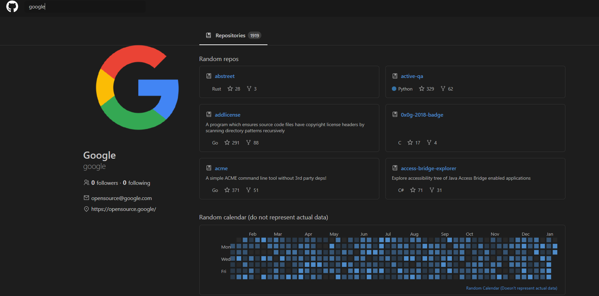

Github dark mode app is built with create-react-app, styled components and typescript witha randomized calendar it recreates and browse overwiew users and repositories fetching github's api using axios.

 

Demo: 

https://dark-mode-github-app-clone.netlify.app/

Repository:

https://github.com/diebraga/GitClone-UI

<Row>
<Col>

Switch theme clicking on the github logo.

</Col>

<Col>

</Col>
</Row>

<Row>
<Col>

</Col>

<Col>

Search for other users by user name.

</Col>
</Row>