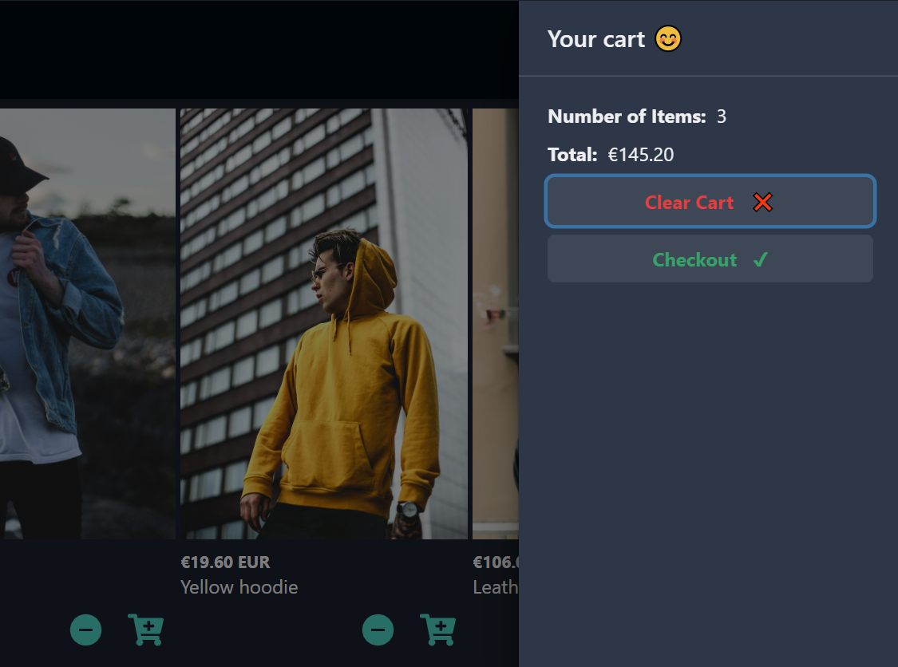
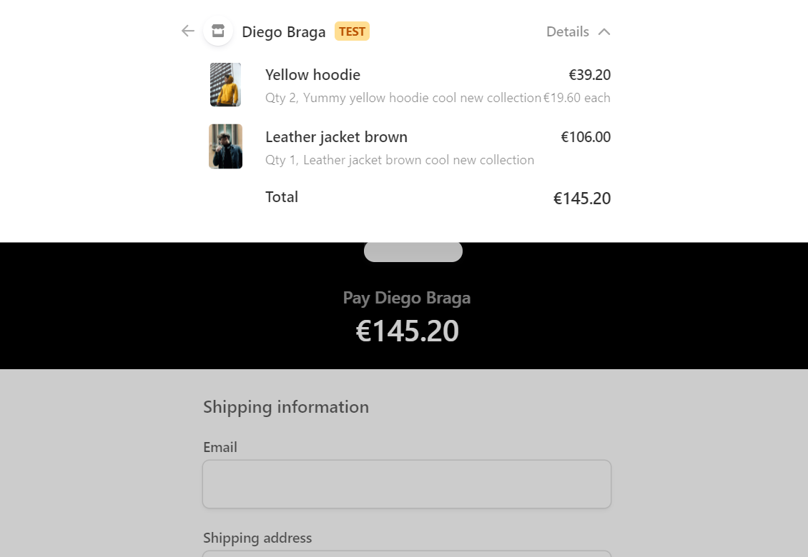
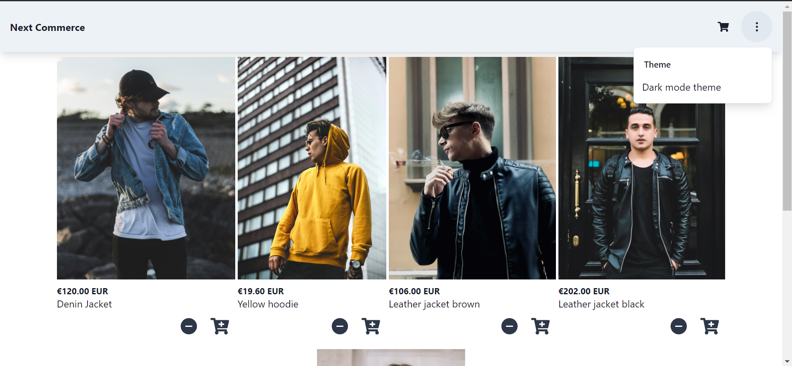
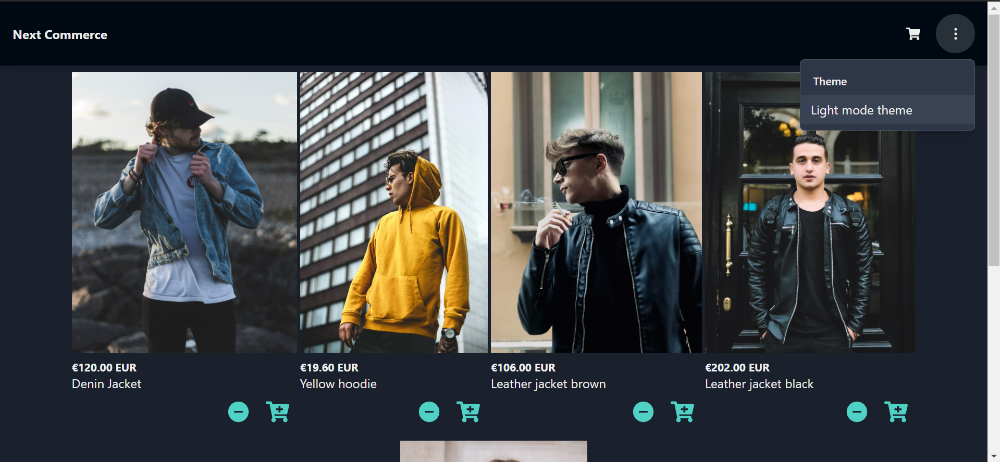

Live Demo:

https://my-own-business.vercel.app/

Repository:

https://github.com/diebraga/my_own_business

View:

<Row>
<Col>

shopping cart

</Col>
<Col>

stripe checkout page

</Col>
</Row>

<Row>
<Col>

Light theme

</Col>
</Row>

<Row>
<Col>

Dark theme

</Col>
</Row>
